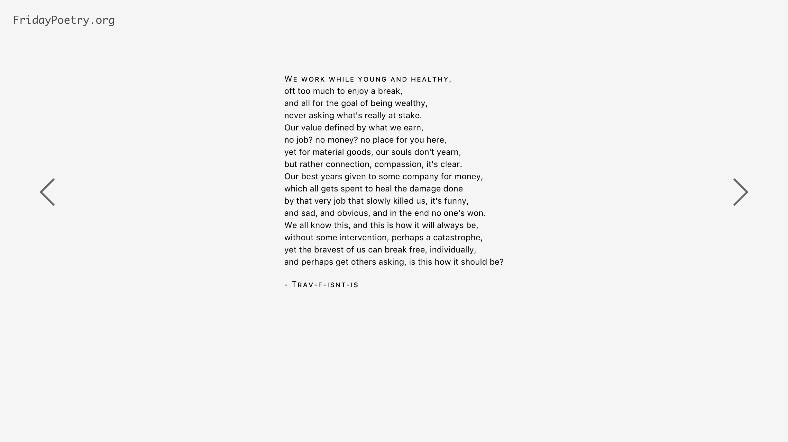

# Friday Poetry

Friday poetry was started by Dan in the MakerSquare alumni Slack Channel
(MakerSquare was a immersive programming course that no longer exists). Every
week, people were encouraged to extend their creative power, and write some
poetry! I enjoyed doing this because it stretched parts of my brain that I don't
use on a regular basis. In fact, I enjoyed doing this so much, I decided to make
it into a website. Here it is!

  

# Usage

To run an instance of the FridayPoetry site, you need to have deno and postgres.

1. Copy .env.example -> .env
2. Update with Postgres DB info

| Command | Description |
| --- | --- |
| `deno task serve` | Serve Website |
| `deno task serve --reset-db` | Drop tables, and create a new poems table |
| `deno task serve --force-friday` | Pretend every day is friday |
| `deno task test` | Run fmt, lint, check, and test |

If the website has no poems in the database, `/` is a 404.  Go to `/new` to create a new poem.
